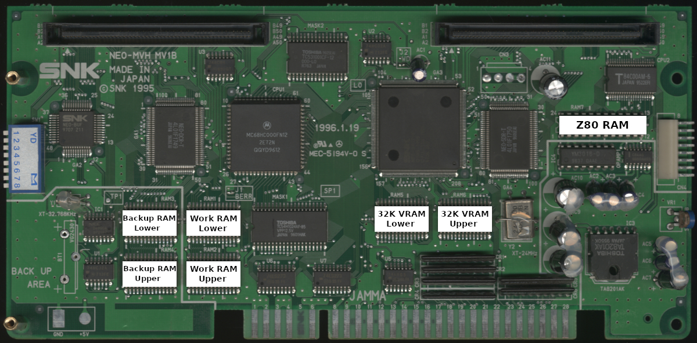

# MV1B / MV1B CHX / MV1B1

These RAM locations cover model numbers MV1B, MV1B CHX, MV1B1.

 

|      RAM       | Location |
| :------------- | :------: |
| 2K VRAM Lower  | NEO-GRZ2 |
| 2K VRAM Upper  | NEO-GRZ2 |
| 32K VRAM Lower |     RAM5 |
| 32K VRAM Upper |     RAM6 |
| Backup Lower   |     RAM3 |
| Backup Upper   |     RAM4 |
| Palette Lower  | NEO-GRZ2 |
| Palette Upper  | NEO-GRZ2 |
| Work Lower     |     RAM1 |
| Work Upper     |     RAM2 |
| Z80 RAM        |     RAM7 |

The 2K VRAM and Palette RAM are built into the [NEO-GRZ2](https://wiki.neogeodev.org/index.php?title=NEO-GRZ2) IC.
