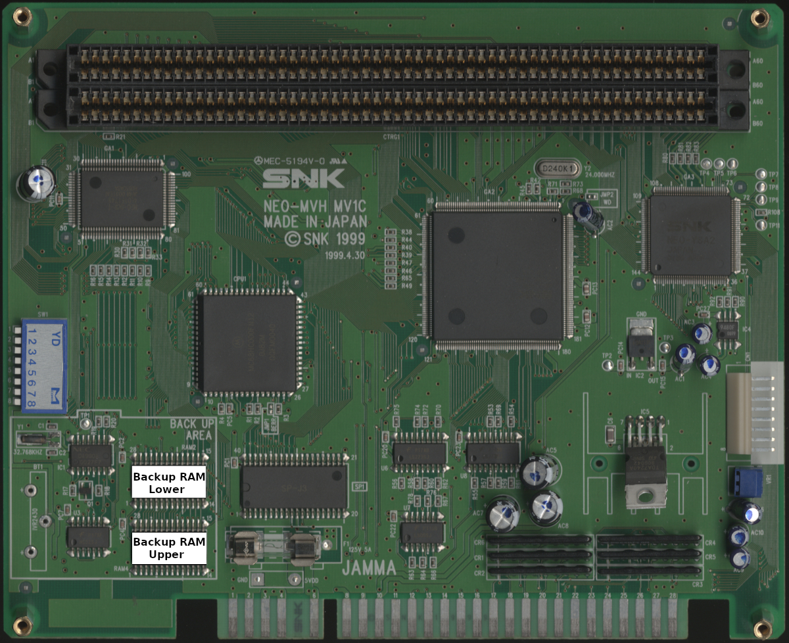
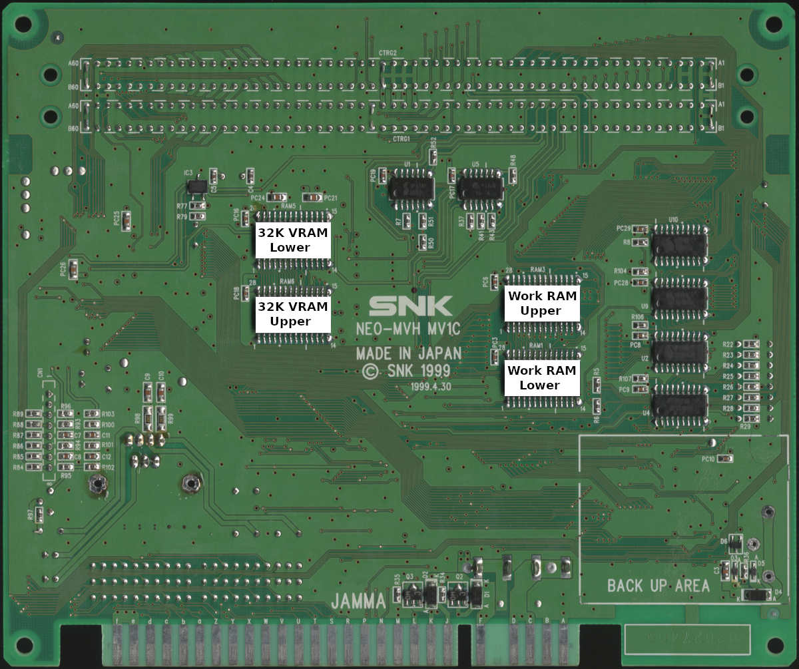

# MV1C

 

|      RAM       | Location |
| :------------- | :------: |
| 2K VRAM Lower  |  NEO-GRZ |
| 2K VRAM Upper  |  NEO-GRZ |
| 32K VRAM Lower |     RAM5 |
| 32K VRAM Upper |     RAM6 |
| Backup Lower   |     RAM2 |
| Backup Upper   |     RAM4 |
| Palette Lower  |  NEO-GRZ |
| Palette Upper  |  NEO-GRZ |
| Work Lower     |     RAM1 |
| Work Upper     |     RAM3 |
| Z80 RAM        | NEO-YSA2 |

The 2K VRAM and Palette RAM are built into the [NEO-GRZ](https://wiki.neogeodev.org/index.php?title=NEO-GRZ) IC.
The Z80 RAM is built into the [NEO-YSA2](https://wiki.neogeodev.org/index.php?title=NEO-YSA2) IC.
