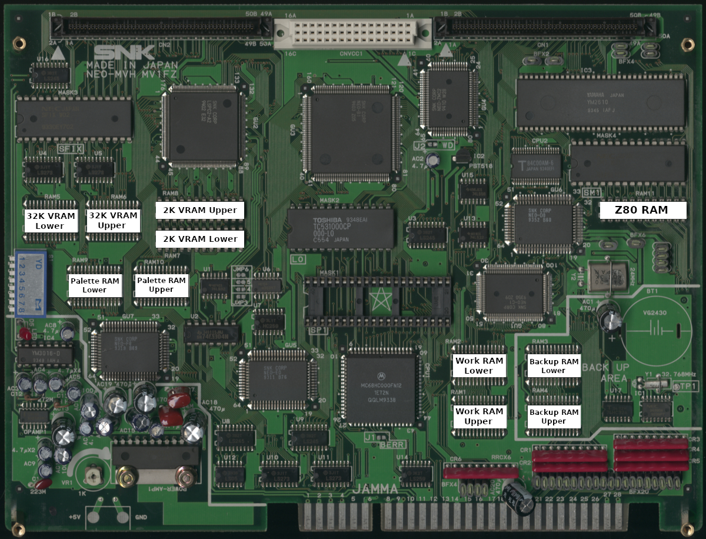

# MV1FZ*

These RAM locations cover model numbers MV1FZ, MV1FZS, MV1FZSB, and MV1FZSB-2.  

|      RAM       | Location |
| :------------- | :------: |
| 2K VRAM Lower  |     RAM7 |
| 2K VRAM Upper  |     RAM8 |
| 32K VRAM Lower |     RAM5 |
| 32K VRAM Upper |     RAM6 |
| Backup Lower   |     RAM3 |
| Backup Upper   |     RAM4 |
| Palette Lower  |     RAM9 |
| Palette Upper  |    RAM10 |
| Work Lower     |     RAM2 |
| Work Upper     |     RAM1 |
| Z80 RAM        |    RAM11 |
