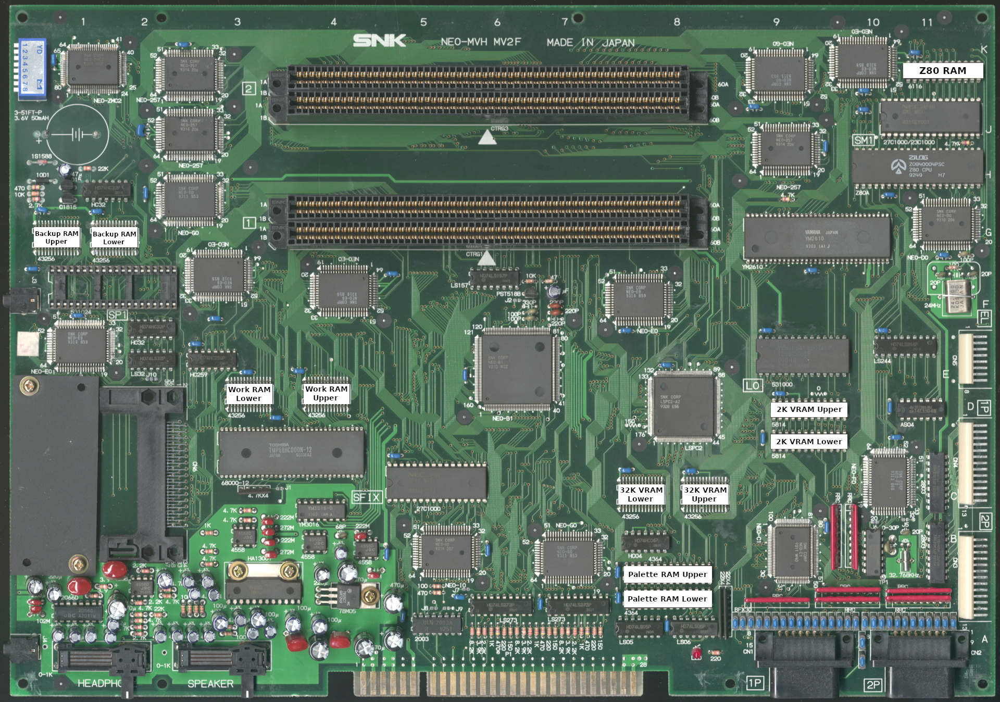

# MV2F / MV2FS

These RAM locations cover model numbers MV2F and MV2FS  

|      RAM       | Location |
| :------------- | :------: |
| 2K VRAM Lower  |     C-D9 |
| 2K VRAM Upper  |       D9 |
| 32K VRAM Lower |     C7.8 |
| 32K VRAM Upper |     C8.1 |
| Backup Lower   |     G1.5 |
| Backup Upper   |     G0.5 |
| Palette Lower  |     A-B8 (lower chip) |
| Palette Upper  |     A-B8 (upper chip) |
| Work Lower     |     D-E3 |
| Work Upper     |     D-E4 |
| Z80 RAM        |      K11 |
