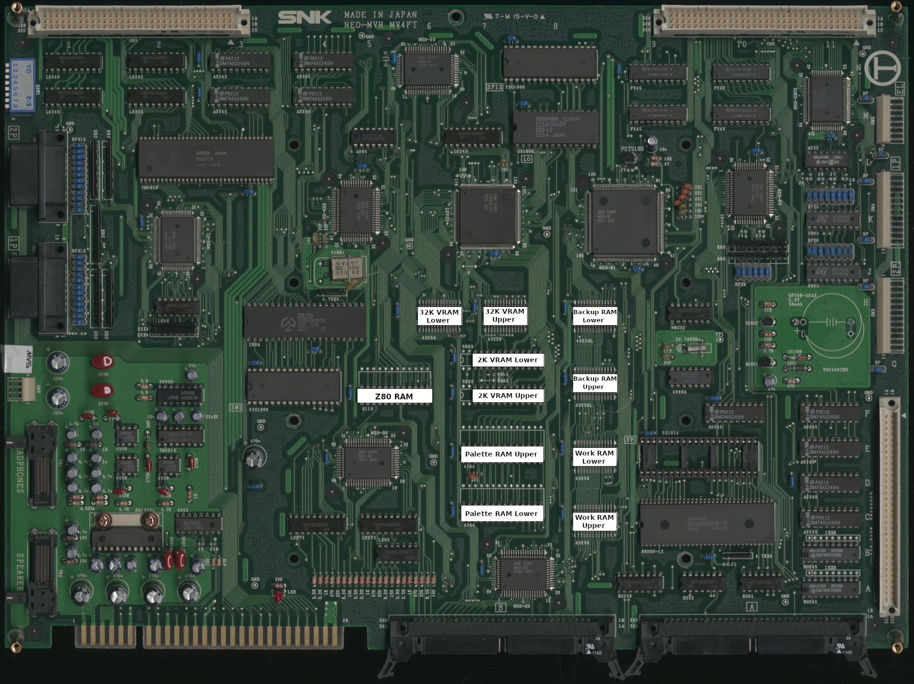

# MV4FT* / MV4FS

These RAM locations cover model numbers MV4FT, MV4FT2, MV4FT4, and MV4FS.  

|      RAM       | Location |
| :------------- | :------: |
| 2K VRAM Lower  |       G7 |
| 2K VRAM Upper  |       F7 |
| 32K VRAM Lower |       H6 |
| 32K VRAM Upper |       H7 |
| Backup Lower   |     H8.5 |
| Backup Upper   |     G8.5 |
| Palette Lower  |       C7 |
| Palette Upper  |       E7 |
| Work Lower     |     E8.5 |
| Work Upper     |     C8.5 |
| Z80 RAM        |     F5.5 |
