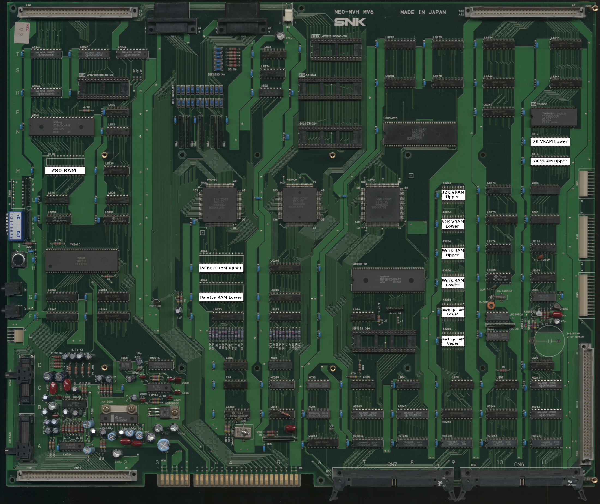

# MV6 RAM Locations
---

|      RAM       | Location |
| :------------- | :------: |
| 2K VRAM Lower  |      N11 |
| 2K VRAM Upper  |    M-N11 |
| 32K VRAM Lower |       K9 |
| 32K VRAM Upper |       L9 |
| Backup Lower   |       F9 |
| Backup Upper   |       E9 |
| Palette Lower  |       G4 |
| Palette Upper  |       H4 |
| Work Lower     |     G-H9 |
| Work Upper     |     H-J9 |
| Z80 RAM        |       M1 |
