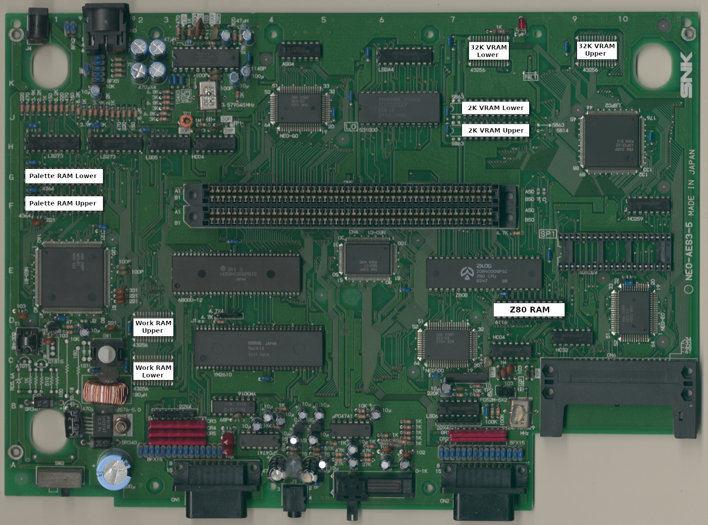

# NEO-AES3-* RAM Locations
---

I only have a NEO-AES3-5, but based on pictures on the interweb these RAM
locations should also be valid for NEO-AES3-2, NEO-AES3-3, NEO-AES3-4, and
NEO-AES3-6 boards.

|      RAM       | Location |
| :------------- | :------: |
| 2K VRAM Lower  |    J7-K8 |
| 2K VRAM Upper  |    H7-J8 |
| 32K VRAM Lower |     K7-8 |
| 32K VRAM Upper |    K9-10 |
| Palette Lower  |       G1 |
| Palette Upper  |       F1 |
| Work Lower     |       C2 |
| Work Upper     |       D2 |
| Z80 RAM        |       D8 |
