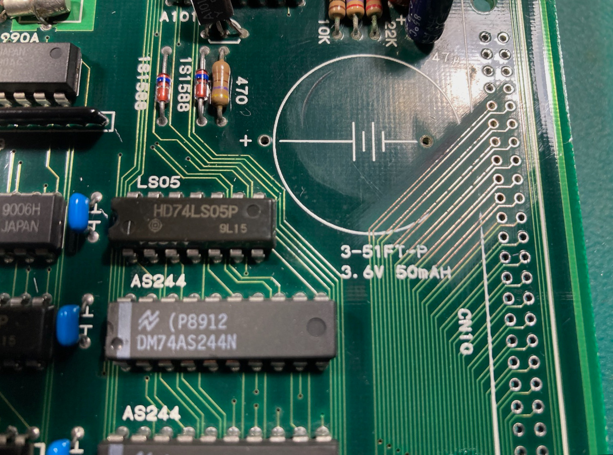

# MV4 (SN: 067063)
---

#### Original Condition
* Bit of battery leakage
  * Maybe damage to traces under the battery
  * Leakage appears to also go under CN10, so will need to pull and examine
* CN6, CN7 (memory card connector) and CN11 have been reflowed
* ALL TESTS PASSED (including z80 tests on all slots)

#### Symptom 1 - Cross hatch all slots
Since ALL TESTS PASSED with diag bios, move onto testing games with unibios.  Games in any/all slots just result in cross hatch.  This is an indication of a P rom address/data issue.

I know from previous experience working on the MV4 that the traces under the battery are the address/data lines for the P roms.  So the first order of business is going to be pulling CN10, cleaning up the corrosion and testing/fixing any broken traces.

This is what the area looked like after removing CN10 and cleaning off the corrosion / exposing the traces.

Used multi-meter to check continuity on those traces and found (starting from the battery) traces 1, 3, 5, and 7 had a break in them.  Tinned all of the exposed copper, repaired the broken traces, cover the area in  lacquer (green nail polish), re-installed CN10 connector.

Cross hatch issue is gone.
