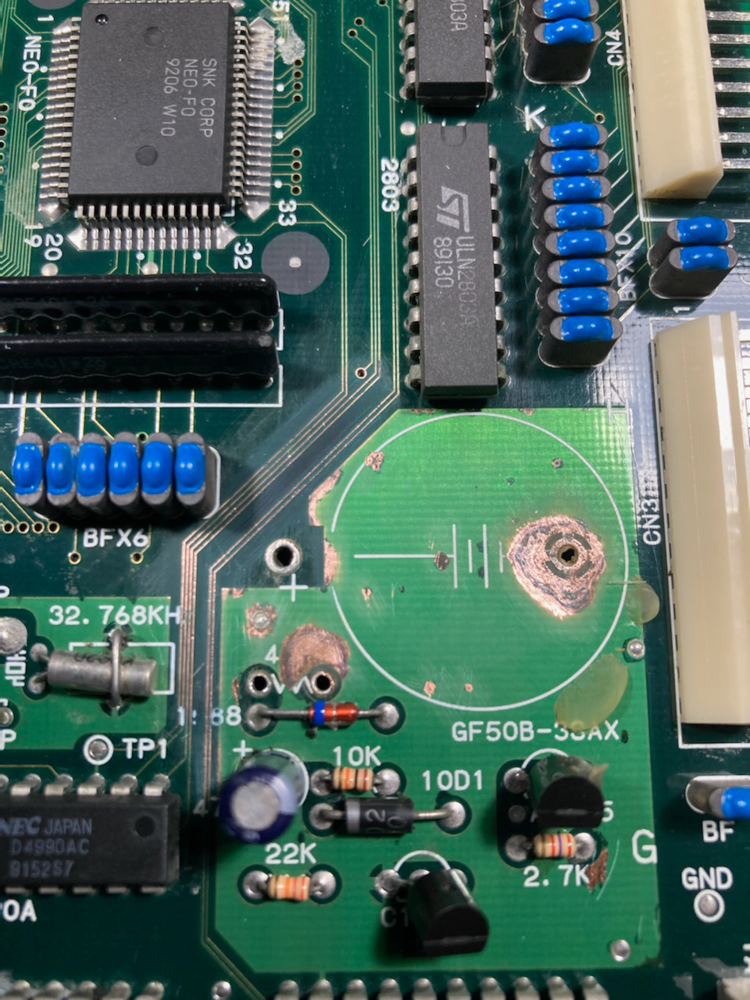
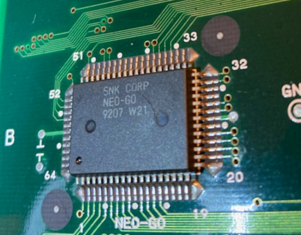
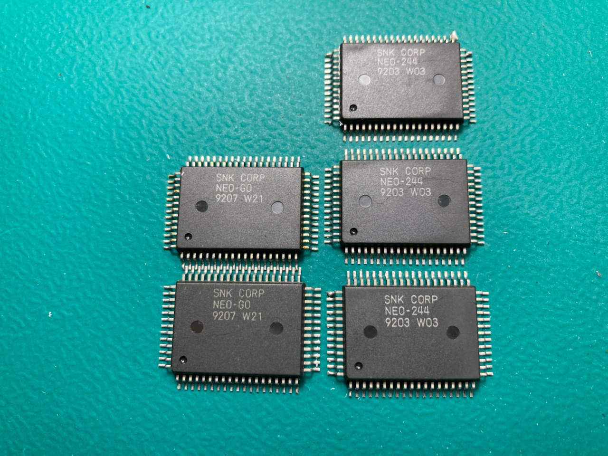

# MV4F (SN: 115676)
---

#### Original Condition
* Bit of battery leakage
  * Likely a couple damaged traces from it
* ALL TESTS PASSED (including z80 tests on all slots)

#### Symptom 1 - Cross hatch all slots
Since ALL TESTS PASSED with diag bios, moved onto testing games with unibios.  Games in any/all slots just result in cross hatch.  This is an indication of a P rom address/data issue.

Go into unibios memory viewer, P rom data is 0x6100 for all addresses for all slots.

First thing to do will be to fix up the battery damage and re-test.  This is what the area looks like after removing the battery damage.

The missing component is a 470ohm resistor that had corrosion on it, so I pulled it.  It normally gets pulled anyways for the battery mod.

Checking continuity on the traces
* First 2 traces had breaks
* 2nd trace in the batch of 4 traces had a break

Tinned all exposed copper, repaired breaks, re-tested and still cross hatch in all slots.  However now the P rom data is all 0xFFFF.  Double checked my repairs, continuity was all good and no bridges.

I had an extra MV4F slot board, so gave it a try to help isolate the issue to the slot board or cpu board.  Games booted ok in all slots, so issues is with the slot board.

With the data all being 0xFFFF, this is likely going to be a data issue.  If it were address related you would expect valid looking data, but it would just be in the wrong location.  Given that all the data lines are bad it makes me think it possibly being caused by some chips not getting enabled when they should be.

74LS245's have the behavior if they are enabled but the input pins are dead they will output high on their output pins.  There should be 2 layers of 74LS245 chips between the P roms and the cpu, so maybe the ones nearest the P roms aren't getting enabled?

Based on that line of thinking use multi-meter to figure out where the P rom data lines go.  They go over to the [NEO-G0](https://wiki.neogeodev.org/index.php?title=NEO-G0)'s (which are basically 4x 74LS245s) on the left of the board.  Started logic probing them to check their enable pins, then I noticed this..

That NEO-G0 is cracked/ruptured.  Swapped it with one from a parts board, cross hatch fixed in all slots.

#### Symptom 2 - ADPCM sound issues
This one was a little weird for symptoms.  I was seeing/hearing this

* Slot 1 - all static sounds
* Slot 2 - mix of working and static sounds
* Slot 3 - sounds seemed ok
* Slot 4 - mix of missing, static, and working sounds

Gave each of the slots a good cleaning as this is often the cause of static sounds.  Didn't make a difference.

Used multi-meter to figure out where the ADPCM related pins on the carts go to, which ended up being the NEO-G0's on the left.  Started logic probing them and didn't see anything obvious.  

I did however notice something a little weird.  A number of the chips on the left (NEO-G0, NEO-244) kinda looked like they might be cracked/ruptured, but it was very faint.  To the naked eye it really just looked like maybe cleaning residue or a scratch.  I cleaned them off with iso to rule out the residue possibility, then looked at them under magnification and came to the conclusion they were actually cracked/rupture.

I ended up swapping 2x NEO-G0's and 3x NEO-244's with ones from a parts board.  These are the pulled chips

Re-tested after the swap and sound is working good in all slots.
