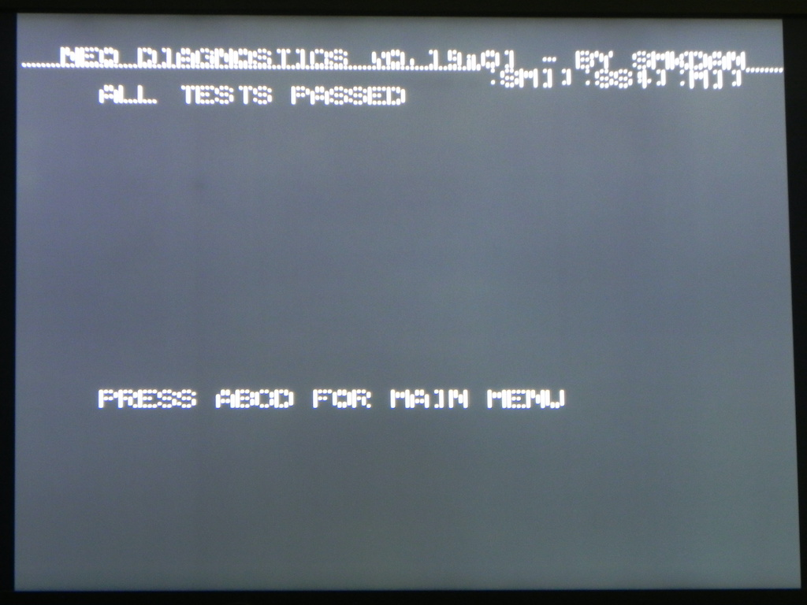

# MV2F (SN: 263635)
---
#### Original Condition
* All of the 470uf filter caps are missing
* Z80 is in socket
* Some trace corrosion in top right of slot board
* Bent pens on right most MV-IC IDC connector

#### Symptom 1 - Weird slot switch behavior
After fixing the missing 470uf, diag bios booted to ALL TEST PASSED.

Tried doing Z80 tests and got some weird behavior that points to some issue with slot switching

* Diag m1 only in slot 1, boots to white, then after ~10 screen becomes normal and has a Z80 -> 68K Comm error with a random actual value.
* Same thing happens if a single diag m1 is in any slot.
* If a diag m1 is in slot 1 and 2 or slot 3 and 4 it will be fine (producing the symptom #2 error)

Based on this it would seem like one of the slot select lines might be floating.

Checked the select pins (54 and 55) on the [NEO-253](https://wiki.neogeodev.org/index.php?title=NEO-253)'s on the right side of the slot board.  Pin 54 is dead on all of them, looks like a corroded trace that goes to pin 2 of the 74F153 @ F4 and pin 11B on CN9 on the slot board.

Fixed the broken trace stopped the weird slot switch behavior.

#### Symptom 2 - Z80 Reported Error Code: 09 (RAM ADDRESS A8-A10)
Get the following in all slots with the Z80 test.

```
Z80 SLOT SWITCH IGNORED (SM1)
SM1 OTHERWISE LOOKS UNRESPONSIVE

IF MV-1B/1C: SOFT RESET & HOLD B
PRESS START TO CONTINUE
```

Pressing start forces the slot switch to the diag m1 cart and we get this

```
Z80->68k COMM ISSUE (HELLO)

EXPECTED: C3
ACTUAL:   49
Z80 REPORTED ERROR CODE: C9
RAM ADDRESS (A8-A10)
```

Use multi-meter to check continuity between A8-A10 on ram/Z80, and find there is no continuity for A10 (pin 40 on Z80, pin 19 on ram).  Following the path of the trace, identify the issue is under the z80's socket.  Removed socket and see an obvious break right at the point where the trace goes to pin 40's via.  Fix trace, re-add Z80 and now Z80 tests pass in all slots.

#### Symptom 3 - Slot 4 has striped S ROM graphics



Every other column of S ROM graphics is missing as seen in the above picture.  This specific issue is mentioned on the neogeo dev wiki's [Graphic Glitches](https://wiki.neogeodev.org/index.php?title=Graphic_glitches#S_ROM_data) page as being possibly caused by a stuck FIX data line.

Used multi-meter to check continuity between FIXD0-FIXD7 on slot 4 ([MVS cart pinout](https://wiki.neogeodev.org/index.php?title=MVS_cartridge_pinout)) and the NEO-253 @ D5.  Found FIXD7 was missing continuity between pin B46 on CHA Bottom and pin 63 of the  NEO-253.  Found/Fixed the broken part of the trace.  Issue resolved.

#### Symptom 4 - Lines in sprites on all slots


We are on to testing games using unibios.  All slots seem to be working for running the game roms, however all slots have lines in the sprites as seen in the picture above.

This is indicating an issue with one or more of the sprite data lines (CR0-CR31).  Since the issue is happening on all slots we should start by checking the CR0-CR31 data lines between the NEO-253's @ 5A-5C and CN8.

Using a multi-meter found there was no continuity for CR13 (pin 41 on NEO-253 @ 5B <=> pin 20B on CN8).  Also using the multi-meter I was able to determine the break was under the NEO-253.  Pulled the NEO-253 and sure enough there was a break between the pad and the trace that goes to the via under the chip.  Repaired the break and reinstalled the NEO-253.  This fixed the issue on slot 1, 3, and 4.

#### Symptom 5 - Lines in sprites on slot 2 only
As with the previous symptom, this also points to an issue with sprite data lines (CR0-CR31).  However since its only effecting slot 2, we should start by checking the CR0-CR31 data lines between slot 2 and the NEO-253's @ 5A-5C.

Since I just pulled and put back the NEO-253 @ 5B, I double checked my soldering and didn't find any issues.  

I booted the board with only a cart in slot 2 and used a logic probe to check all the slot 2 inputs on the NEO-253s for activity.  CR8 (pin 1 on the NEO-253 @ 5B) had no activity.  Followed the trace and found a section that had a bit of corrosion about an inch to the left of the NEO-253.  Removed the solder mask and there was a break in the trace there.  Repaired the break and issue went away.
