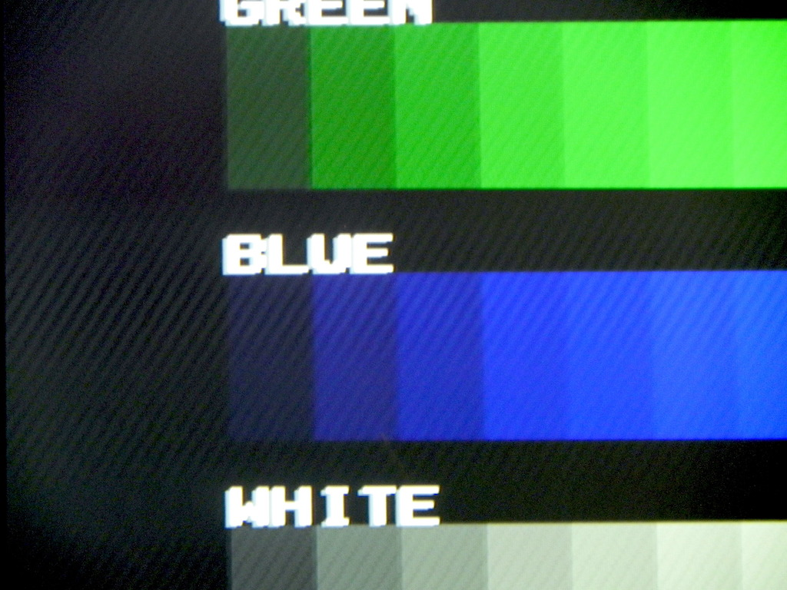
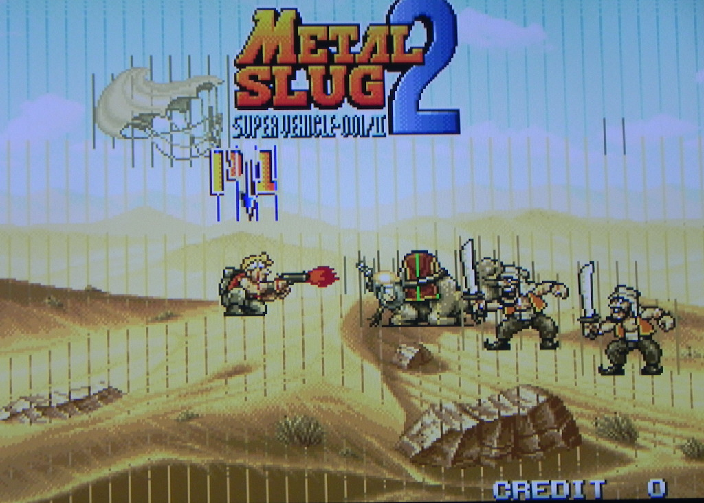
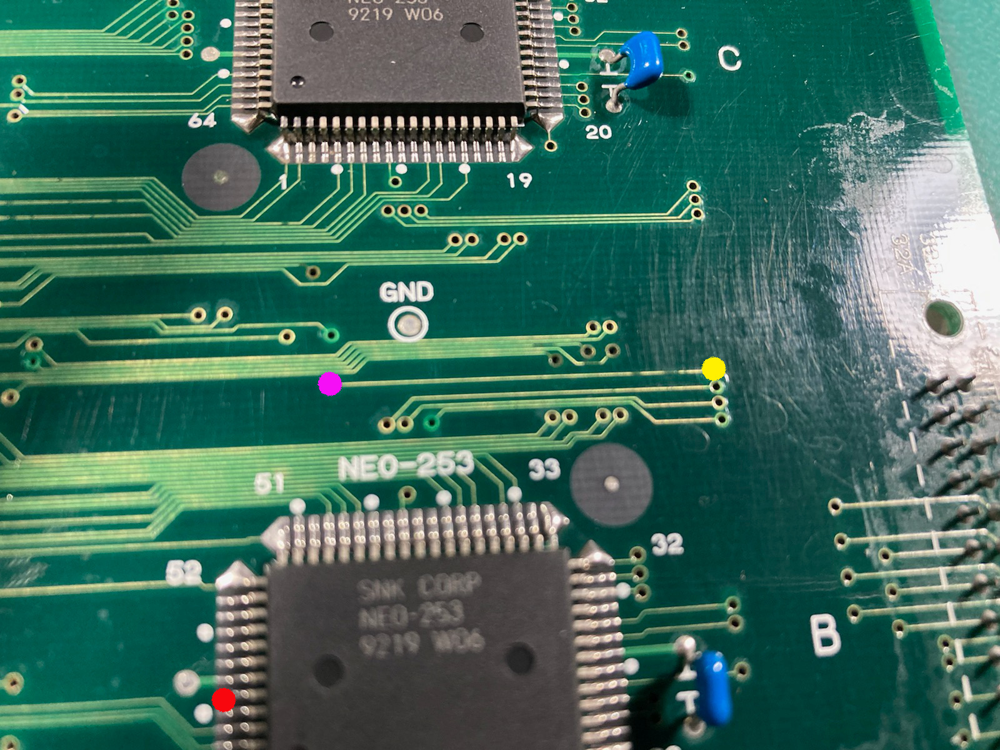

# MV4F (SN: 270480)
---

#### Original Condition
* No obvious signs of damage or battery leakage
* ALL TESTS PASSED (including z80 tests on all slots)
  * Diag m1 jungle sound is distorted

#### Symptom 1 - Interference in video signal
There is a scrolling diagonal interference lines in the video image as seen below

The seem to get worse when sound plays.  This along with the distorted diag m1 jingle are likely going to be caused by a faulty capacitor.  So first order of business will be replace them all.

Caps replaced fix both issues.

#### Symptom 2 - Lines in sprites on all slots

We are on to testing games using unibios.  All slots seem to be working for running the game roms, however all slots have lines in the sprites as seen in the picture above.

This is indicating an issue with one or more of the sprite data lines (CR0-CR31).  Since the issue is happening on all slots we should start by checking the CR0-CR31 data lines between the [NEO-253](https://wiki.neogeodev.org/index.php?title=NEO-253)'s @ 5A-5C and CN8.

Using a multi-meter found there was no continuity for CR19 (pin 59 on NEO-253 @ B5 <=> pin 21B on CN8).  Further testing narrowed down the issue to this section

There was continuity between the red (pin 59) and the purple via, but there was none between the purple and yellow via's.  Removing the solder mask over that corrosion near the yellow via revealed a break in the trace.

Repairing the broken trace fixed the sprite issue.
