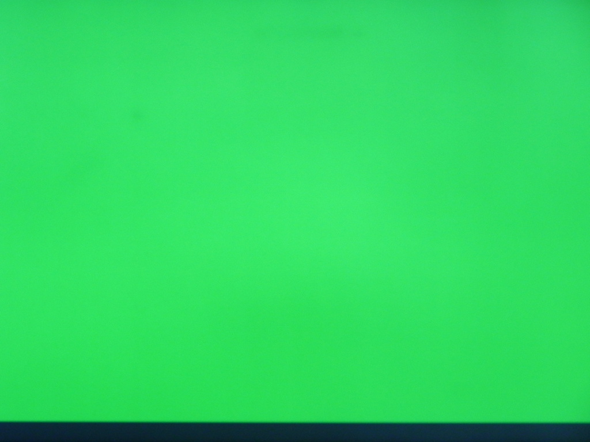
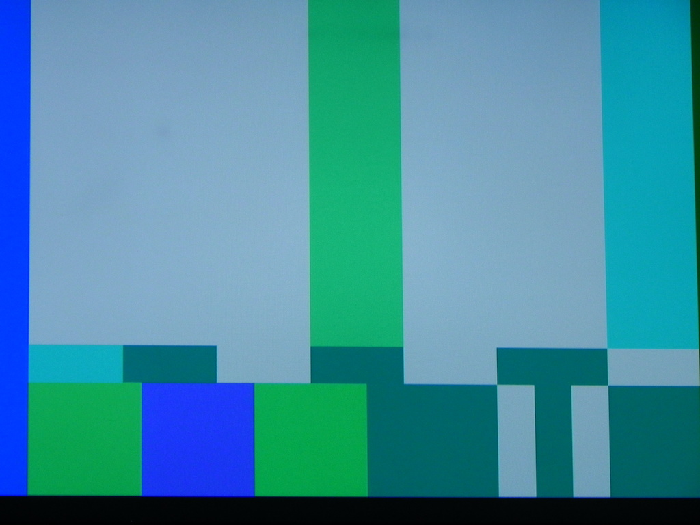
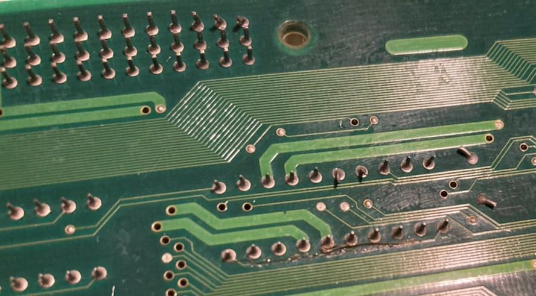

# MV4FT2 (SN: 336163)
---
#### Original Condition
* No obvious signs of physical damage to board
* Lower Backup ram was replaced
  * Not on straight
  * Solder blobs

#### Symptom 1 - BRAM UNWRITABLE (UPPER)
Booted with diag bios and got

```
BRAM UNWRITABLE (UPPER)
```

Used logic probe and test WE (pin 27) on bram upper and it was dead.  This signal for the pin should be coming from the 74HC32 @ H9.

Used multi-meter to hunt down where the break is.  The first thing I checked showed where the problem was.  The trace coming out of WE pin goes to a via about 1/2 inch away, there was no continuity between them.  Examined the trace and there was a small amount of corrosion on it and some of the adjacent traces.  Cleaned up the corrosion, found/fixed the break in that WE trace.  While I was in the area, re-seated the lower backup ram to get it on straight and cleanup the solder blobs.

Retested and ALL TEST PASSED

#### Symptom 2 - Solid color screen on z80 tests on all slots
When doing the diag m1/z80 tests it resulted in the solid color screen, but the m1/z80 tests passed.  You can tell because it plays the little sound jingle twice (first time is indicating its starting the tests, 2nd time that is completed tests without errors).



I also blind navigated to the SMPTE color bars test and got this



So this is likely pointing to some data path issue from the S rom on the carts to the NEO-B1 on the cpu board. Since this issue is happening on all slots best to start at the multiplexer IC and work my ways towards the NE0-B1 on the cpu board.

Used a multi-meter I determined the FIX data lines for all slots go to the [NEO-253](https://wiki.neogeodev.org/index.php?title=NEO-253) @ 5D which is a 4 to 1 multiplexer.

Plugged in a diag m1 cart into slot 2 and booted the diag bios/m1 to it.  Then used a logic probe to check the inputs/output of that NEO-253.  Found the inputs from slot 2 cart were all dead, and the outputs from the NEO-253 were all high.  Tried again in a different slot, same thing, dead inputs.  So this seems to be pointing to the S rom chip not getting enabled.

I know the S rom share address lines with the C roms and decided to logic probe the clock signals going to the cart slots (CHA board) as these will likey be involved with enabling/disabling the S rom.  Used logic probe and found that all clock signals (24M, 12M, 8M, PCK1B, PCK2B) were stuck high.  Used multi-meter to see where 24M was coming from, it was the [NEO-244](https://wiki.neogeodev.org/index.php?title=NEO-244) @ A2.  Used logic probe and confirmed it was stuck high and then checked the input for that buffer and found it was dead, did the same for 12M and input was dead too.  Used multi-meter to find these input pins were coming from CN8 and there was no continuity issue, so this points to something on the CPU board as the issue.

Continued to use the multi-meter to follow the 24M path through CN8 to the cpu board and found it went to the 74F245 @ N9.  I found the problem with the IC



Not sure how I missed that when looking over the board, but the trace going from pin 10 (GND) to pin 1 (ENABLE) was burnt out.  I added a temp cable between the pins and re-tested.  This resolved the issue.  

Before I permanently fixed the issue, I grabbed a picture of metal slug 2's attract mode to see what the effect would be on sprites with there being no clock signals to the cart.  Pretty bad.


