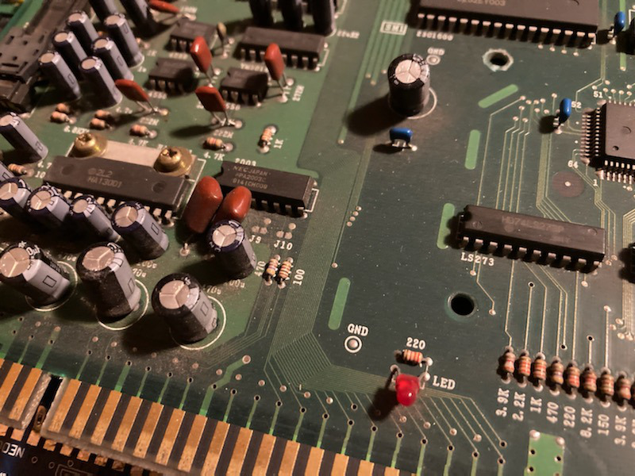

# MV4FT (SN: 292340)
---
#### Original Condition
* No obvious signs of physical damage to board
* No battery leakage/damage

#### Symptom 1 - No Video
Boot the board with my supergun and get no video signal.  Used logic probe to probe sync signal.  Its pulsing coming out of the [NEO-I0](https://wiki.neogeodev.org/index.php?title=NEO-I0), but is high at the jamma connector.  I know from previously working on MV4FT's there is a design flaw with the sync signal causing it to be bad.  The issue revolves around a 100 ohm and 470 ohm resistor on the sync line.  This is a picture of the board i'm working on so you can see where the 100/470 ohm resistors are at.

Some boards have a factory fix for this issue by adding a couple resistors on the bottom of the board as seen here (last picture)

https://www.mvs-scans.com/index.php/MV4FT

My board does not have these factory fix resistors.  

This is a picture of an MV4FT2 where SNK resolved they issue by simply swapping the location of the 100 and 470 ohm resistors

Doing the same swap on this MV4FT resolved the no video issue.  With video working the board boots to ALL TESTS PASSED (including z80 tests on all slots)
