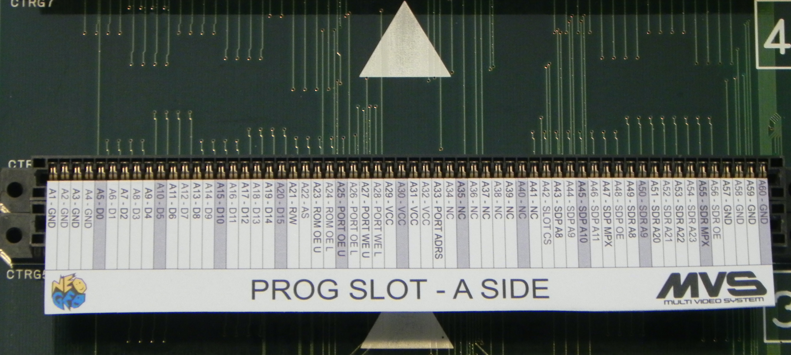
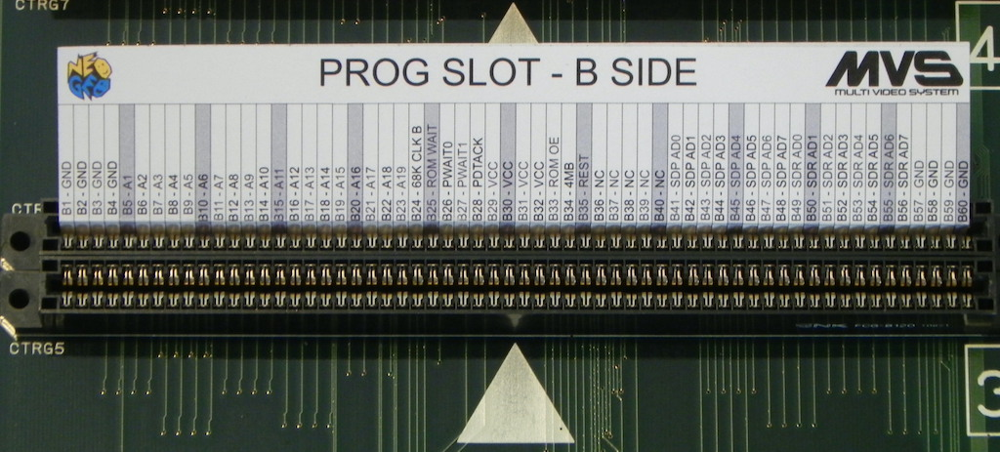

# Slot Pins Inserts
---
One of the headaches when doing repairs is when you need to do continuity tracing on a slot.  With there being so many pins its easy to loose track of what pin is what.  Below are slot inserts that can be printed out to help identify pins.

[aes_slot_pins_insert.pdf](slot_pins_inserts/aes_slot_pins_insert.pdf) 
[mvs_slot_pins_insert.pdf](slot_pins_inserts/mvs_slot_pins_insert.pdf)

Here is an example of the PROG slot insert for MVS boards.

With the insert flipped down its identifies all the 'A' side pins

Flipped up all the 'B' side pins

If you happen to have a Silhouette cutting machine you can use these files with their software to print and cut out the inserts.

[aes_slot_pins_insert.studio3](slot_pins_inserts/aes_slot_pins_insert.studio3) 
[mvs_slot_pins_insert.studio3](slot_pins_inserts/mvs_slot_pins_insert.studio3)
