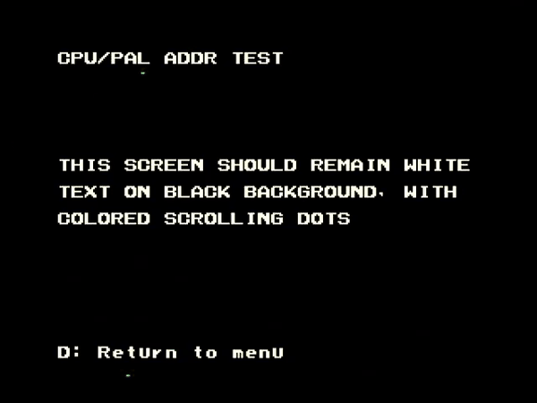
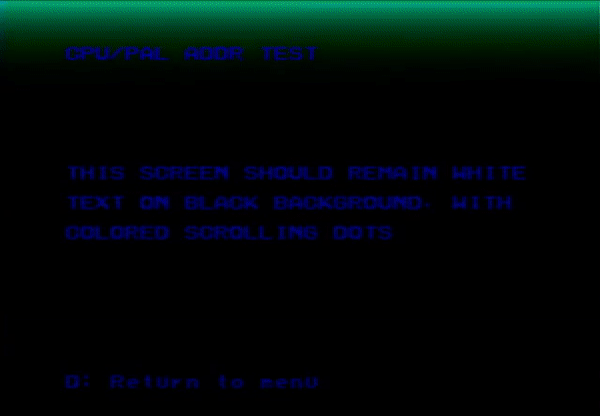

# CPU/PAL Address Test
---
This test is targeted at boards that have a NEO-B1 chip, but it may also catch stuff on older/newer chips that do the same.

The NEO-B1 is responsible for drawing the screen.  For each pixel it will go to the correct PAL ram address and do a read so that pixel's color gets sent to the 74ls273's and onto the video dac.  (I believe this actually happens multiple times per pixel, since each pixel is made up of multiple scan lines on the screen)

The CPU doesn't have direct access to the PAL ram chips, instead the NEO-B1 handles the address lines, and other chips handle the data (NEO-G0/74LS245s) and WE lines.  When the CPU wants to read/write data from the PAL ram, the NEO-B1 is suppose to stop its screen drawing and pass along the address lines from the CPU to the PAL ram. The CPU's read/write gets done, then the NEO-B1 will go back to drawing the screen.

This test is for catching the specific case where the NEO-B1 doesn't pass along the CPU address lines and just continues its normal screen drawing.  The read/write will still happen to the PAL ram since the data/WE lines go through other chips, but the address they are done against end up being whatever PAL address the NEO-B1 was on when doing the screen drawing.

If this specific situation is happening you will also have PAL RAM DATA issues with random error data (on both PAL chips) and random addresses and your screen color will be random each boot.  You will need to boot with ABCD to skip automatic testing and then go to this test.

This is what the screen should look like if everything is working ok

This test is just writing an incrementing value to PAL address 0x4000AA.  This address is not part of any color on the screen so the text remains white and the background is black.  The colored dots are an expected effect from writing to PAL ram while the screen is being drawn.  NOTE: you will not see the dots if you run this in MAME.

This is what the screen looks like if the issue is happening

It will be a continually changing rainbow of colors.  This happens because the incrementing value is actually being written to the PAL addresses that the NEO-B1 is accessing to draw the screen.

On the board I actually saw this issue on, the fault ended up being the NEO-B1.  However when doing some failure testing I found the issue can happen if A22I going into the NEO-B1 is floating.
