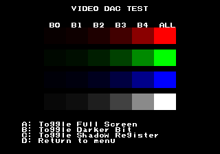
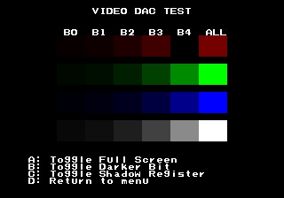

# Video DAC Test
---
The video DAC test can help track down color issues by giving both an overview
of each of the individual digital input signals and being able to isolate those
input signals.

## Overview
Some simple background info related to this test

### Colors
Each color value on the NEO GEO is 16 bits, with 5 bits for each red, green and
blue.  The remaining bit is referred to as the dark(er) bit and according to
the NEO GEO development docs is suppose to do an RGB - 1 effect (almost none).

For more in depth details refer to the [Colors](https://wiki.neogeodev.org/index.php?title=Colors)
page on the [Neo-Geo Dev Wiki](https://wiki.neogeodev.org/index.php?title=Main_Page).

### Shadow/No Shadow Registers
A screen wide shadow (darkening) effect can be applied via the REG_SHADOW or
removed via the REG_NOSHADOW registers.  

### Video DAC
Each of the analog RGB signals are generated from 7 digital signals.  The weight
that each of these digital signals play in generating the RGB signal is
determined by the resistor connected to it.  The lower the resistor's ohm value
the higher the weight.

|  Digital Signal |  Resistor |
|:---------------:|:---------:|
| Color Bit 0     | 3.9k ohm  |
| Color Bit 1     | 2.2k ohm  |
| Color Bit 2     |   1k ohm  |
| Color Bit 3     |  470 ohm  |
| Color Bit 4     |  220 ohm  |
| Dark(er) Bit    | 8.2k ohm  |
| Shadow Register |  150 ohm  |

For more in depth details refer to the [Video DAC](https://wiki.neogeodev.org/index.php?title=Video_DAC) page on the [Neo-Geo Dev Wiki](https://wiki.neogeodev.org/index.php?title=Main_Page).

## Main Screen
This screen has a grid of color blocks that provides a quick glance to see if
there is any issue with a specific color bit.

The B0 B1 .. B4 heading at the top of the grid is indicating which individual
color bit is enabled for that column, while the 'ALL' column has all bits for
that color enabled.  The 4th row is the combination of the 3 previous rows. ie:
the B2 column of the 4th row has color bit 2 enabled for red, green, and blue.

|   Button   | Description |
|:----------:| :-----------|
|     A      | Enter full screen mode |
|     B      | Toggles dark(er) bit.  This will cause no visual change to the screen, but you should be able to detect it if you use a logic probe the DAC's 3x 8.2K ohm resistors. |
|     C      | Toggle shadow register effect.  When the screen is in its normal state you should see pulsing on the DAC's 3x 150 ohm resistors.  When it goes darker the DAC's 3x 150 ohm resistors should be 100% low. |
|     D      | Return to main menu |

## Full Screen
Full screen mode fills the screen with a single block from the grid.  This makes
it possible to isolate an individual color bit since it will be on the only
color on the screen.  When entering full screen mode you will start out at
the color from the top left of the grid (red B0).  Using left/right/up/down
you can switch the color that fills the screen, which will change based on the
color block grid from the main Video DAC screen.

You should expect to see pulsing on the input of the associated resistor for
the selected color bit and color.  ie: if you are on color bit 2 on red you
should only see pulsing on the input of red's 1k ohm resistor.

|   Button   | Description |
|:----------:| :-----------|
| Left/Right | Cycle through color bits / all columns as seen on the grid on the main screen |
|  Up/Down   | Cycle through red, green, blue and all rows as seen on the grid on the main screen |
|     B      | Toggles dark(er) bit.  This will cause no visual change to the screen.    **IMPORTANT**: If you are using a logic probe instead of and oscilloscope, you will want to validate this bit using the color bit 4 (B4) color set.  The lower color bits will likely always show the input to the 8.2k resistor(s) as being low.   If viewing red, green or blue you should expect to only see an effect on that color's 8.2K resistor.  While viewing the combined colors on all 3x 8.2k resistors. |
|     C      | Toggle the shadow register effect.  You should see the screen get darker then lighter as you toggle it repeatedly.   **IMPORTANT**: If you are using a logic probe instead of and oscilloscope, you will want to validate this bit using the color bit 4 (B4) color set.  The lower color bits will likely always show the input to the 150 resistor(s) as being low.  If viewing red, green or blue you should expect to only see an effect on that color's 150 resistor.  While viewing the combined colors on all 3x 150 resistors.|
|     D      | Return to Video DAC main screen |

## Examples

### MV6 with a light yellowish tint to it

MV6 has a light yellowish tint to it that you could mainly see on white. On the
Video DAC main screen nothing really looked to out of the ordinary with
red/green/blue rows, but the text and 4th row had the yellowish tint.

When toggling the shadow register on the main screen it got darker as expected,
but also the yellowish tint went away causing the text/4th row to be a gray
color.  Upon toggling it a number of times it became apparent the red and blue
rows were not switching between being darker/normal.  This was confirmed by
using a logic probe on red/blue's 150 ohm resistor and seeing it stuck low
when toggling the shadow register.  With them being stuck low it would cause
them to always be in the darkened state.

From there the issue was back tracked to the 74LS05 (hex inverter) that feeds
the 150 ohms resistors (and 8.2k resistors).  The input on the 74LS05 was
flipping high/low when toggling the shadow register, but the output on it for
red/blue were always low.  Swapping the 74LS05 fixed the issue.

### MV4 colors are a bit off
The colors are a bit off on the MV4.  Going to the Video DAC main screen the
red B4 color block is missing (black).  It looked like this (simulated in MAME)

Measuring red's 220 ohm resister with a multi-meter show its OL.  Replacing the
200 ohm resistor fixes the issue.

The same type of missing color block can be caused by the input from the
74LS273 being stuck low/floating.  This would indicated the 74LS273 is bad or
the input coming into it is.
